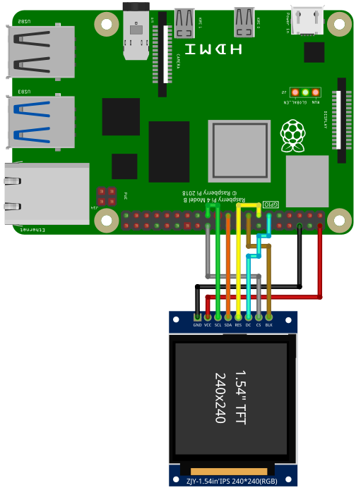

The ST7789 is a controller for RGB Displays. Data is transferred
using the SPI interface. Displays are available in different sizes
and amount of pixels. Please setup [SPI](./setup_spi.html) before
using the display.

## Library

To use the ST7789, import the library `st7789`

```SmallBASIC
import st7789
```

## Function Reference

### Open Device

```
Open()
Open(LCD_WIDTH)
Open(LCD_WIDTH, LCD_HEIGHT)
Open(LCD_WIDTH, LCD_HEIGHT, SPI_DEVICE)
Open(LCD_WIDTH, LCD_HEIGHT, SPI_DEVICE, GPIO_CHIP)
Open(LCD_WIDTH, LCD_HEIGHT, SPI_DEVICE, GPIO_CHIP, PIN_RST, PIN_DC, PIN_BL)
Open(LCD_WIDTH, LCD_HEIGHT, SPI_DEVICE, GPIO_CHIP, PIN_RST, PIN_DC, PIN_BL, SPI_SPEED)
Open(LCD_WIDTH, LCD_HEIGHT, SPI_DEVICE, GPIO_CHIP, PIN_RST, PIN_DC, PIN_BL, SPI_SPEED, SPI_PAGESIZE)
```

Open the ST7789 using the SPI interface.

- `LCD_WIDTH`
  - Integer: >0
  - Number of pixels in x.
  - Optional: default value is `240`
- `LCD_HEIGHT`
  - Integer: >0
  - Number of pixels in y.
  - Optional: default value is `240`
- `SPI_DEVICE`
  - String
  - SPI device
  - Optional: default value is `/dev/spidev0.0`
- `GPIO_CHIP`
  - String
  - GPIO chip name
  - Optional: default value is `gpiochip0`
- `PIN_RST`
  - Integer: 1 ... 53
  - GPIO-Pin number of the reset line
  - Optional: default value is `27` (for pin 13)
- `PIN_DC`
  - Integer: 1 ... 53
  - GPIO-Pin number of the Data/Comand line
  - Optional: default value is `17` (for pin 11)
- `PIN_BL`
  - Integer: 1 ... 53
  - GPIO-Pin number of the background light line
  - Optional: default value is `22` (for pin 15)
- `SPI_SPEED`
  - Integer: 3800 ... 250000000
  - SPI Frequency in Hz
  - Optional: default value is `10000000`
  - Maximum speed depends on many parameters. Test max.
    speed at which your display is still happy to
    work. I was able to drive my display with 125MHz.
    But I don't know how stable the data transfer will
    be over time at that speed.
- `SPI_PAGESIZE`
  - Integer: >0
  - SPI page size (buffer size)
  - Optional: default value is `4096`
  - The default value on a Raspberry Pi is 4096. You can
    check the current settings with: `cat /sys/module/spidev/parameters/bufsiz`.
    If you want to set a different page size, you have to
    edit `/boot/cmdline.txt` and add i.e. `spidev.bufsiz=32768`
    for a new buffer size of 32768 bytes.

Example:

```SmallBASIC
const LCD_WIDTH    = 240
const LCD_HEIGHT   = 240
const SPI_DEVICE   = "/dev/spidev0.0"
const GPIO_CHIP    = "gpiochip0"
const PIN_RST      = 27
const PIN_DC       = 17
const PIN_BL       = 22
const SPI_SPEED    = 50000000
const SPI_PAGESIZE = 4096

st7789.Open(LCD_WIDTH, LCD_HEIGHT, SPI_DEVICE, GPIO_CHIP, PIN_RST, PIN_DC, PIN_BL, SPI_SPEED, SPI_PAGESIZE)
```

>If your board does not have a pin for the background light,
>you still have to specify a GPIO pin. This GPIO pin will be
>used by the library, even if nothing is connected.

### Close Device

```
Close()
```

Close the ST7789 controller.

### Display Buffer

```
Display()
```

Display the current buffer. If you perform a drawing command, only the
buffer will be changed. The display will not show the changes until
`Display()` is called.

### Set Color

```
Color(fg)
Color(fg, bg)
```

Set the foreground color `fg` and background color `bg`.

- `fg`
  - Integer: 32bit
  - Foreground color
- `bg`
  - Integer: 32bit
  - Background color
  - Optional parameter. Default value is current background color.

### Clear Screen

```
Cls()
Cls(color)
```

Clear the screen using color `color`. If color is omitted, the current
background color is used.

- `color`
  - Integer: 32bit
  - Clear color
  - Optional parameter. Default value is current background color.

### Draw a Pixel

```
Pset(x1, y1)
Pset(x1, y1, color)
```

Draw a pixel at point `(x1, y1)` with color `color`

- `x1, y1`
  - Integer: 0 ... 65535
  - Position in pixel
- `color`
  - Integer: 32bit
  - Line color
  - Optional parameter. Default value is current foreground color

### Draw a Line

```
Line(x1, y1, x2, y2)
Line(x1, y1, x2, y2, color)
```

- `id`
  - Deviced id
- `x1, y1`
  - Integer: 0 ... 65535
  - Position of start point in pixel
- `x2, y2`
  - Integer: 0 ... 65535
  - Position of end point in pixel
- `color`
  - Integer: 32bit
  - Line color
  - Optional parameter. Default value is current foreground color.

### Draw a Rectangle

```
Rect(x1, y1, w, h)
Rect(x1, y1, w, h, color)
Rect(x1, y1, w, h, color, fill)
```

Draw a rectangle with the top left corner at point `(x1, y1)`, a
width of `w`and a height of `h` with line color `color`. If `fill`
is 1 (true), a filled rectangle will be drawn.

- `x1, y1`
  - Integer: 0 ... 65535
  - Position of top left corner in pixel
- `w, h`
  - Integer: 0 ... 65535
  - Width and height in pixel
- `color`
  - Integer: 32bit
  - Line color
  - Optional parameter. Default value is current foreground color.
- `fill`
  - Integer: 0, 1
  - If 1, a filled rectangle will be drawn.
  - Optional parameter. Default value is 0.

### Draw a Rectangle with Round Corners

```
Roundrect(x1, y1, w, h)
Roundrect(x1, y1, w, h, radius)
Roundrect(x1, y1, w, h, radius, color)
Roundrect(x1, y1, w, h, radius, color, fill)
```

Draw a rectangle with the top left corner at point `(x1, y1)`, a
width of `w`and a height of `h` with line color `color` and
rounded corners. The radius in pixel of the corners if given by
`radius`. If `fill` is 1 (true), a filled rectangle will be drawn.

- `x1, y1`
  - Integer: 0 ... 65535
  - Position of top left corner in pixel
- `x2, y2`
  - Integer: 0 ... 65535
  - Position of bottom right corner in pixel
- `radius`
  - Integer: 0 ... 255
  - Radius if corners in pixel
  - Optional parameter. Default value is 4.
- `color`
  - Integer: 32bit
  - Line color
  - Optional parameter. Default value is current foreground color
- `fill`
  - Integer: 0, 1
  - If 1, a filled rectangle will be drawn.
  - Optional parameter. Default value is 0.

### Draw a Circle

```
Circle(x, y, radius)
Circle(x, y, radius, color)
Circle(x, y, radius, color, fill)
```

Draw a circle at position `(x, y)` with radius `radius` in pixel. `color`
defines the line color. If `fill` is set to `1` (`true`), then the
circle is filled with `color`. If no color is given, the current foreground
color will be used.

- `x`
  - Integer: 0 ... 65535
  - X-position in pixel
- `y`
  - Integer: 0 ... 65535
  - Y-position in pixel
- `radius`
  - Integer: 0 ... 65535
  - Radius of the circle in pixel
- `color`
  - Integer: 32bit
  - Line or fill color
  - Optional parameter. Default value is current foreground color.
- `fill`
  - Integer: 0, 1
  - If 1, a filled circle will be drawn
  - Optional parameter. Default value 0

### Draw a Triangle

```
Triangle(x1, y1, x2, y2, x3, y3)
Triangle(x1, y1, x2, y2, x3, y3, color)
Triangle(x1, y1, x2, y2, x3, y3, color, fill)
```

Draw a triangle with the corner points `(x1, y1)`, `(x2, y2)` and
`(x3, y3)` with line color `color`. If `fill` is 1 (true), a filled
triangle will be drawn.

- `x1, y1`, `x2, y2`, `x3, y3`
  - Integer: 0 ... 65535
  - Position of corner points in pixel
- `color`
  - Integer: 32bit
  - Line color
  - Optional parameter. Default value is current foreground color
- `fill`
  - Integer: 0, 1
  - If 1, a filled rectangle will be drawn.
  - Optional parameter. Default value is 0.

### Print Text

```
Print(text)
Print(text, color)
```

Print text `text` with text color `color`. After printing the text, the
text cursor advances by one text-line. The following special characters are
supported:

| Character | Description                              |
|:---------:|:-----------------------------------------|
| `\a`      | Set cursor position to upper left (0, 0) |
| `\b`      | Move cursor back by one position         |
| `\n`      | Go to start of current line              |
| `\r`      | Go to line below                         |

- `text`
  - String
  - Text to be printed
- `color`
  - Integer: 32bit
  - Line color
  - Optional parameter. Default value is current foreground color.

### Set Text Cursor Position

```
At()
At(x)
At(x, y)
```

Set the text cursor to the pixel `(x, y)`.

- `x`
  - Integer: 0 ... 65535
  - X-position in pixel
  - Optional parameter. Default value is `0`
- `y`
  - Integer: 0 ... 65535
  - Y-position in pixel
  - Optional parameter. Default value is `0`

### Set Text Size

```
SetTextSize(size)
```

Set text size to `size`. `size` must be an multiple of 8.

- `size`
  - Integer: 8, 16, 24, 32, ..., 8*n
  - Text size in pixel

### Copy Array to Screen

```
SetArray(A)
SetArray(A, x)
SetArray(A, x, y)
SetArray(A, x, y, trans)
```

Copy the content of the 2D-array `A` to screen at position `(x,y)` using
transparency mode `trans`. The following transparency modes are supported:

| Mode | Description                                             |
|:----:|:--------------------------------------------------------|
| 0    | no transparency                                         |
| 1    | Every element of `A` with value `0` will be transparent |

- `A`
  - 2D-Array of integers: Every element is 32bit long.
  - Every element contains the color of a pixel
- `x` and `y`
  - Integer: 0 ... 65535
  - Position of copied area in pixel
  - Optional parameter. Default value is (0, 0).
- `trans`
  - Integer: 0, 1
  - Transparency mode
  - 0 -> no transparency
  - 1 -> transparancy
  - Optional parameter. Default value is 0.

### Copy Screen to Array

```
A = GetArray()
A = GetArray(x)
A = GetArray(x, y)
A = GetArray(x, y, w)
A = GetArray(x, y, w, h)
```

Copy the screen context inside the rectangle with top-left corner at
`(x, y)`, a width of `w` and a height of `h` to the 2D-array `A`.

- `A`
  - 2D-Array of integers: Every element is 32bit long
  - Every element contains the color of a pixel
- `x` and `y`
  - Integer: 0 ... 65535
  - Position of top-left corner of copied area in pixel
  - Optional parameter. Default value is (0, 0).
- `w`
  - Integer: 0 ... 65535
  - Width if copy area in pixel
  - Optional parameter. Default value is screen size in x.
- `h`
  - Integer: 0 ... 65535
  - Height if copy area in pixel
  - Optional parameter. Default value is screen size in y.


## Example

For running this example, you need a ST7789 compatible display.
The examples are based on the Waveshare 1,3", 240 x 240 Pixel.
This display runs with 5V. Check your display. Many displays only
support 3.3V. The naming of the pins can be slightly different.

Please wire the display as shown in the following two examples:

```
 ----------------         ----------
  RPi            |       | TFT
  PIN 19 (MOSI)  |-------| DIN, MOSI, SDA
  PIN 23 (SCLK)  |-------| CLK, SCL
  PIN 24 (CE0)   |-------| CS
  PIN 11 (GPIO17)|-------| DC, D/C
  PIN 13 (GPIO27)|-------| RST, RES
  PIN 15 (GPIO22)|-------| BL
  GND            |-------| GND
  5V             |-------| VIN
 ----------------         ---------
```




### 1. Example

```SmallBasic
import st7789

func RGBto565(r,g,b)
    'Convert RGB 888 to 16bit RGB565 and swap bytes
    return ( (r BAND 0b11111000) BOR (g rshift 5) BOR ((g BAND 0b00011100) lshift 11) BOR ((b BAND 0b11111000) lshift 5) ) 
end

const BLACK   = 0
const BLUE    = RGBto565(0  ,  0,255)
const RED     = RGBto565(255,  0,0  )
const GREEN   = RGBto565(  0,255,0  )
const CYAN    = RGBto565(  0,255,255)
const MAGENTA = RGBto565(255,  0,255)
const YELLOW  = RGBto565(255,255,0  )
const WHITE   = RGBto565(255,255,255)
const DRAW_FILLED = 1

const LCD_WIDTH    = 240
const LCD_HEIGHT   = 240
const SPI_DEVICE   = "/dev/spidev0.0"
const GPIO_CHIP    = "gpiochip0"
const PIN_RST      = 27
const PIN_DC       = 17
const PIN_BL       = 22
const SPI_SPEED    = 50000000
const SPI_PAGESIZE = 4096

st7789.Open(LCD_WIDTH, LCD_HEIGHT, SPI_DEVICE, GPIO_CHIP, PIN_RST, PIN_DC, PIN_BL, SPI_SPEED, SPI_PAGESIZE)
' if you have a 240x240 TFT and don't need any extra configuration, then use:
' st7789.Open()
st7789.Cls()
st7789.Color(WHITE, 0)

st7789.Line(0,0,239,239)
st7789.RoundRect(60,60,120,120,5, BLUE)
st7789.Circle(119,119,50, RED, DRAW_FILLED)

st7789.At(30,10)
st7789.SetTextSize(24)
st7789.Print("SmallBASIC")

st7789.Rect(  0,209, 30,30,   BLACK, DRAW_FILLED)
st7789.Rect( 29,209, 30,30,     RED, DRAW_FILLED)
st7789.Rect( 59,209, 30,30,   GREEN, DRAW_FILLED)
st7789.Rect( 89,209, 30,30,    BLUE, DRAW_FILLED)
st7789.Rect(119,209, 30,30,    CYAN, DRAW_FILLED)
st7789.Rect(149,209, 30,30, MAGENTA, DRAW_FILLED)
st7789.Rect(179,209, 30,30,  YELLOW, DRAW_FILLED)
st7789.Rect(209,209, 30,30,   WHITE, DRAW_FILLED)

st7789.Display()

st7789.Close()

print("Done")
```

### 2. Example: Speed Test

You can test different SPI transfer speeds and check if the controller still
works. Set `SPI_SPEED` to a small value and then go for higher Frequencies.

```smallbasic
import st7789

func RGBto565(r,g,b)
    return ((r BAND 0b11111000) BOR (g rshift 5) BOR ((g BAND 0b00011100) lshift 11) BOR ((b BAND 0b11111000) lshift 5)) 
end

const WHITE   = RGBto565(255,255,255)
const DRAW_FILLED = 1

const LCD_WIDTH = 240
const LCD_HEIGHT = 240
const SPI_DEVICE = "/dev/spidev0.0"
const GPIO_CHIP = "gpiochip0"
const PIN_RST = 27
const PIN_DC = 17
const PIN_BL = 22
const SPI_SPEED = 50000000  ' Test the max speed i.e. 1000000 (1MHz), 10000000 (10MHz), 50000000 (50MHz), 125000000 (125MHz)
const SPI_PAGESIZE = 4096

st7789.Open(LCD_WIDTH, LCD_HEIGHT, SPI_DEVICE, GPIO_CHIP, PIN_RST, PIN_DC, PIN_BL, SPI_SPEED, SPI_PAGESIZE)
st7789.Color(WHITE, 0)

TimeStart = ticks()
for yy = 20 to 220
  ii++
  st7789.Cls()
  st7789.Circle(119, yy,20, WHITE, DRAW_FILLED)
  st7789.Display()
next
print ii / (ticks() - TimeStart) * 1000; " FPS"

st7789.Close()

print("Done")
```

