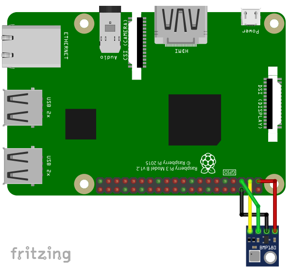

The BMP180 is a temperature and pressure sensors using
the I2C-protocol for communication.

## Library

To use the BMP180, import the library `bmp180`

```SmallBASIC
import bmp180
```

## Function Reference

### Open Device

```
Open()
Open(interface)
Open(interface, address)
```

Open the BMP180 on interface `interface` with I2C address `address`.


- `interface`
  - String
  - Path to I2C-Interface.
  - Optional parameter. Default value is `"/dev/i2c-1"`
- `address`
  - Integer: 0 ... 255
  - Device address
  - Optional parameter. Default value is `0x77`.

Example:

```SmallBASIC
Open("/dev/i2c-1", 0x77)
```


### Measure

```
M = StartMeasurement()
```

Measure temperature and pressure.

- `M`
  - 1d-array with two real values
  - `M[0]`: Temperature in °C
  - `M[1]`: Pressure in Pascal

### Close device

```
Close()
```

Close the BMP180 device.


## Example

For running this example, you need a BMP180. SmallBASIC
PiGPIO 2 is using the I2C-protocol for communication. The
Raspberry Pi supports this protocol in hardware, but by
default the protocol is disabled. Therefore you have to
setup I2C as described [here](./setupi2c.html).

In the next step please wire the sensor as shown in the following image.



The I2C bus is using pin 2 (SDA1) and 3 (SCL1). The sensor can be
driven with a voltage of 3.3V. 

```SmallBasic
import bmp180

bmp180.open("/dev/i2c-1", 0x77)

delay(500)

for ii = 1 to 50
  M = bmp180.StartMeasurement()

  locate 5,0
  print "T: "; M[0]; "  P: "; M[1]

  delay(500)
next
```
