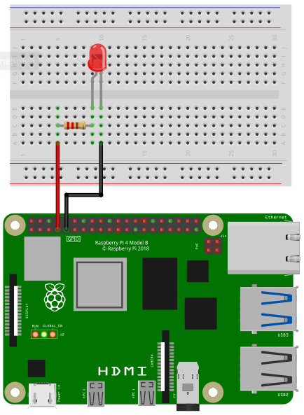

## GPIO pin numbering

The pins on the Raspberry Pi are number according to Broadcom's GPIO numbering:


## Library

To access the gpio pins import the library `gpio`:

```SmallBASIC
import gpio
```

## Function Reference

### Open

```
Open()
Open(chipname)
```

Open gpio access to the chip specified by the optional parameter `chipname`.
If `chipname` is not provided, the standart gpiochip of the Raspberry Pi will be
opened.

- `chipname`
  - String
  - GPIO chip name
  - Optional parameter. Default value is `gpiochip0`

### SetInput

```
SetInput(PinNumber)
```

Sets GPIO pin `PinNumber` as an input. The internal pullup-resistor will be
set automaticly. Before using a GPIO pin, you should use either `SetInput` or
`SetOutput`.

- `PinNumber`
  - Integer: 0 ... 53
  - Pin number according to Broadcom GPIO numbering

### SetOutput

```
SetOutput(PinNumber)
```

Sets GPIO pin `PinNumber` as an output. Before using a GPIO pin, you should
use either `SetInput` or `SetOutput`.

- `PinNumber`
  - Integer: 0 ... 53
  - Pin number according to Broadcom GPIO numbering

### Write

```
Write(Pin, Level)
```

If `Pin` is configured as output, the voltage level `level` can be set to ground
(low) or +3.3V (high).

- `Pin`
  - Integer: 0 ... 53
  - Pin number according to Broadcom GPIO numbering
- `Level`
  - Integer: 0 or 1

Example:

```smallbasic
Write(4, 0)   ' Sets pin 4 to low (ground)
Write(4, 1)   ' Sets pin 4 to high (+3.3V)
```

### Read

```
Status = Read(Pin)
```

If `Pin` is configured as input, the voltage level can be read. If the specified
pin is at ground (low), `Status` will be `1`. If the pin is at +3.3V (high)
`Status` will be 0.

- `Pin`
  - Integer: 0 ... 53
  - Pin number according to Broadcom GPIO numbering
- `Status`
  - Integer: 0 or 1
  - 0 -> 3.3V
  - 1 -> Ground

Example:

```smallbasic
Status = Read(4)   ' Reads the voltage level of pin 4
```

### Trigger

```
Trigger(Pin)
Trigger(Pin, Duration)
Trigger(Pin, Duration, Level)
```

If pin `Pin` is configured as output, a trigger pulse at this pin will be emitted with a
`Duration` in microseconds and a voltage level `Level` of low or high.

- `Pin`
  - Integer: 0 ... 53
  - Pin number according to Broadcom GPIO numbering
- `Duration`
  - Integer: 1 ... 100
  - Duration in microseconds
- `Level`
  - Integer: 0 or 1
  - Voltage level of trigger

Example:

```smallbasic
Trigger(4, 50, 1)  ' A 50 µs Trigger pulse at pin 4 with +3.3V (high)
```

### Wait for Trigger

```
Status = WaitForTrigger(Pin)
Status = WaitForTrigger(Pin, Timeout)
```

Wait for a raising edge event at the specified pin `Pin`. `Timeout` is in seconds.
Maximum timeout is 255s. `Timeout` an optional parameter.

- `Pin`
  - Integer: 0 ... 53
  - Pin number according to Broadcom GPIO numbering
- `Timeout`
  - Integer: 1 ... 255
  - Timout in seconds
  - Optional parameter: Default value is 1.
- `Status`
  - Integer: -1, 0, 1

    | Value | Status               |
    |:-----:|:---------------------|
    | -1    | error                |
    |  0    | time out             |
    |  1    | rising edge detected |


Example:

```smallbasic
Status = WaitForTrigger(4, 1)  ' Pin 4; timeout 1s
```

### Close

```
Close()
```

When closing a SmallBASIC program, gpio access will be automatically closed. If you want
to manually close gpio access, use this function.

## Example Code

### 1. LED

In the following image you can see how to wire a LED.



Depending on the type of LED you need a certain resistor. When using the LED without a resistor,
you will destroy the LED and maybe even parts of your Raspberry Pi.

When you buy a LED, look for two important values in the specification: Forward Voltage and Forward Current.
The third important value is the Supply Voltage. In case of a Raspberry Pi it is 3.3V. Online you
can find many LED resistor calculators. But if you want to see your LED blinking without studying to much
and you don't expect maximum brightness, then go for 220 Ohms or even 1000 Ohms.

Connect the resistor to pin 4 and the LED to ground.

```SmallBASIC
import gpio

gpio.Open()
gpio.SetOutput(4)

for ii = 1 to 10
  v = !v
  gpio.Write(4, v)
  delay(100)
next
```

### 2. Button

In the following image you see the wiring of a push button. 
When you press the button, the circuit will be closed, otherwise
the circuit is open. The button is connected to pin 4 and
ground. An internal pullup resistor will be enabled automatically.


```SmallBASIC
import gpio

v = 0

gpio.Open()
gpio.SetInput(4)

while(1)
  print gpio.Read(4)
  delay(500)
wend
```

### 3. Trigger

```SmallBASIC
import gpio

v = 0

gpio.Open()
gpio.SetOutput(4)

for ii = 1 to 10
  gpio.Trigger(4)
  delay(200)
next
```

### 4. Wait for Trigger

```SmallBASIC
import gpio

v = 0

gpio.Open()
gpio.SetInput(4)

result = gpio.WaitTrigger(4, 5)

select case result
  case  0: print "Time out"
  case  1: print "Rising edge detected"
  case -1: print "Error"
end select
```
