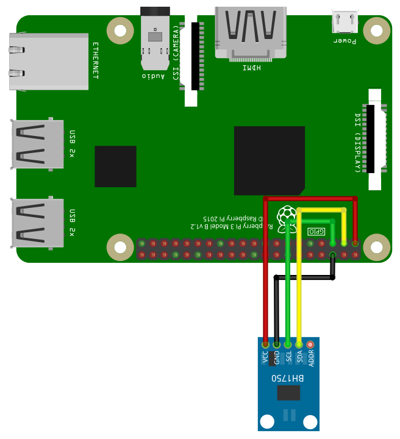

# I2C

Before start coding you need to setup I2C on the Raspberry Pi. Please following these [instructions](setupi2c.html).

## I2C Pins


| Pin | Function |
|:---:|:--------:|
| 2   | SDA      |
| 3   | SCL      |

## Library

Access the basic I2C command with the library `i2c`:

```SmallBASIC
import i2c
```

## Function Reference

### Open device

```
id = Open(address)
id = Open(address, interface)
```

Open a connected I2C device with address `address` on I2C interface `interface`.
`interface` is an optional parameter. Several devices can be opened. `id` will be
used to identify the device.

- `address`
  - Integer: 0 ... 127
  - I2C device address
- `interface`
  - String
  - I2C interface name
  - Optional parameter. Default value is `/dev/i2c-1`
- `id`
  - Device id

Example:

```smallbasic
id = open(0x55)
id = open(0x55, "/dev/i2c-1")
```

### Close device

```
Close(id)
```

When closing a SmallBASIC program, I2C access will be automatically closed. If you want
to manually close I2C access for the device with device id `id`, use this function.

- `id`
  - Device id

### Write to I2C device

```
Write(id, dataByte)
Write(id, dataArray)
```

Send one byte `dataByte` or an 1d array `dataArray` of bytes to the devices with
device id `id`.

- `id`
  - Device id
- dataByte
  - Integer: 0 ... 255
  - One byte of data
- dataArray
  - 1D-array of integers [0 ... 255, 0 ... 255, ... ]
  - Array of byte data

Example:

```SmallBasic
Write(id, 0x20)
Write(id, [0x20, 0x21, 0xA3])
```

### Write to register of a I2C device 

```
WriteReg(id, reg, dataByte)
WriteReg(id, reg, dataArray)
```

Send one byte `dataByte` or an 1d array `dataBytes` of bytes to the devices with
device id `id`.

- `id`
  - Device id
- `reg`
  - Integer: 0 ... 255
  - Device register
- dataByte
  - Integer: 0 ... 255
  - One byte of data
- dataArray
  - 1D-array of integers [0 ... 255, 0 ... 255, ... ]
  - Array of byte data

Example:

```smallbasic
WriteReg(id, 0x05, 0x20)
WriteReg(id, 0x05, [0x20, 0x21, 0xA3])
```

### Read from I2C device

```
res = Read(id)
res = Read(id, bytes)
```

Read number of bytes `bytes` from the device with device id `id`. `bytes` is an
optional parameter.

- `id`
  - Device id
- bytes
  - Integer
  - Number of bytes to read from device
  - Optional paramater. Default value is `1`
- `res`
  - Integer or 1d-array of integer
  - Data read from device
  - If more than 1 byte is read, `res` is an 1d array.

### Read register of I2C device

```
res = Read(id, reg)
res = Read(id, reg, bytes)
```
Read number of bytes `bytes` from the register `reg` of the device with device id
`id`. `bytes` is an optional parameter.

- `id`
  - Device id
- `reg`
  - Integer: 0 ... 255
  - Device register
- `bytes`
  - Integer
  - Number of bytes to read from device.
  - Optional paramaeter. Default value is `1`
- `res`
  - Integer or 1d-array of integer
  - Data read from device
  - If more than 1 byte is read, `res` is an 1d array.

Example:

```smallbasic
res = ReadReg(id, 0x05)       ' Read one byte from register 0x05
res = ReadReg(id, 0x05, 5)    ' Read five bytes from register 0x05
```

### Read byte from SMBus device

```
res = SmbusReadByte(id, reg)
```

Read one byte from the register `reg` of the SMBus device with device id `id`.

- `id`
  - Device id
- `reg`
  - Integer: 0 ... 255
  - Device register
- `res`
  - Integer: 0 ... 255
  - Data read from device

Example:

```smallbasic
res = SmbusReadByte(id, 0x05)       ' Read one byte from register 0x05
```

### Read word from SMBus device

```
res = SmbusReadWord(id, reg)
```

Read one word (2 bytes) from the register `reg` of the SMBus device with device id `id`.

- `id`
  - Device id
- `reg`
  - Integer: 0 ... 255
  - Device register
- `res`
  - Integer: 0 ... 65535
  - Data read from device

Example:

```smallbasic
res = SmbusReadWord(id, 0x05)       ' Read one byte from register 0x05
```

### Write byte to SMBus device

```
SmbusWriteByte(id, reg, data)
```

Send one byte to the register `reg` of the SMBus device with device id `id`.

- `id`
  - Device id
- `reg`
  - Integer: 0 ... 255
  - Device register
- `data`
  - Integer: 0 ... 255
  - One byte of data

Example:

```smallbasic
SmbusWriteByte(id, 0x05, 0xA2)       ' Write 0xA2 to register 0x05
```

### Write word to SMBus device

```
SmbusWriteWord(id, reg, data)
```
Send one word (2 bytes) to the register `reg` of the SMBus device with device id `id`.

- `id`
  - Device id
- `reg`
  - Integer: 0 ... 255
  - Device register
- `data`
  - Integer: 0 ... 65535
  - Two byte of data

Example:

```smallbasic
SmbusWriteWord(id, 0x05, 0xA202)       ' Write 0xA202 to register 0x05
```

## Examples

### 1. BH1750 - Ambient Light Sensor



```SmallBASIC
import i2c

Print "Connect to BH1750"

sensor = i2c.Open(0x23, "/dev/i2c-1")

' Power down
i2c.write(sensor, 0x00)
' Power on
i2c.write(sensor, 0x01)
delay(1000)

' Read one time with low resolution
d = i2c.ReadReg(sensor, 0x23, 2)
ValueLowRes = ((d[0] lshift 8) BOR d[1]) / 1.2
delay(1000)

' Read one time with high resolution
d = i2c.ReadReg(sensor, 0x20, 2)
ValueHighRes = ((d[0] lshift 8) BOR d[1]) / 1.2

print "Low resolution : " + ValueLowRes  + " lx"
print "High resolution: " + valueHighRes + " lx"
```

### 2. PiSugar 3 Plus - Power Supply

```SmallBASIC
import i2c

Print "Access PiSugar 3 Plus"

PiSugar = i2c.Open(0x57, "/dev/i2c-1")

ChargeStatus = i2c.SmbusReadByte(PiSugar, 0x2A)
print ChargeStatus; "%"

VoltageHigh = i2c.SmbusReadByte(PiSugar, 0x22)
VoltageLow = i2c.SmbusReadByte(PiSugar, 0x23)
Voltage = (VoltageHigh lshift 8) + VoltageLow
print Voltage; "mV"

IsPowerConnected = i2c.SmbusReadByte(PiSugar, 0x02) rshift 7
print "USB Power connected: "; IsPowerConnected

print "Seconds of RTC: "; i2c.SmbusReadByte(PiSugar, 0x37)
```
