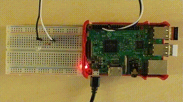

If you want to let a LED blink or measure the temperature in your room, you can use
[SmallBASIC](https://smallbasic.github.io) on a Raspberry PI. As an example you can
connect a LED and a resistor to a GPIO-Pin of your Raspberry Pi, write a short
SmallBASIC programm and enjoy the blinking LED:

```smallbasic
import gpio

const PIN_GPIO4 = 4

gpio.SetOutput(PIN_GPIO4)

for ii = 1 to 5
	gpio.Write(PIN_GPIO4, 1)
	delay(500)
	gpio.Write(PIN_GPIO4, 0)
	delay(500)
next
```




## News

__December 14 2024__: SmallBASIC PiGPIO 2 supports now all Pi's from Zero to 5. It can
even run on other LINUX systems. The API got a complete rewrite and is therefore not
anymore compatible with SmallBASIC PiGPIO 1.

## Setup and Pin Numbering

- [Setup SmallBASIC PIGPIO 2](./setup.html)
- [Setup I2C](./setup_i2c.html)
- [Setup SPI](./setup_spi.html)
- X [Setup PWM](./gpio_numbering.html)
- [Naming and Numbering of the GPIO pins](./gpio_numbering.html)

## Function Reference and Examples

- [Generic GPIO](./gpio.html): Digital input and output
- [Generic I2C](./i2c.html): Generic I2C and SMBus interface
- [Generic SPI](./spi.html): Generic SPI interface
- [Framebuffer](./framebuffer.html): Graphics output to the Linux framebuffer
- [SSD1306 compatible OLED Display](./ssd1306.html): Graphics on this a small and cheap b&w OLED display
- [ADS1015 and ADS1115 Voltage Sensor](./ads1x15.html): Measure voltages
- [BMP180](./bmp180.html): Measure temperature and pressure
- [MPU6050](./mpu6050.html): Accelerometer and gyroscope

## Supported Hardware

- [ADS1015 and ADS1115 Voltage Sensor](./ads1x15.html)
- [BH1750 Ambient Light Sensor (generic I2C)](./i2c.html)
- [BMP180 Temperature and Pressure Sensor](./bmp180.html)
- [BMP280 Temperature and Pressure Sensor (generic SPI)](./spi.html)
- [LED (generic GPIO)](./gpio.html)
- [MPU6050 - Accelerometer and Gyroscope](./mpu6050.html)
- [Pi Sugar 3 plus - Battery/USB power supply and charger (generic I2C)](./i2c.html)
- [Push Button (generic GPIO)](./gpio.html)
- [SSD1306 OLED Display](./ssd1306.html)

## Links

- [SmallBasicPIGPIO at Github](https://github.com/Joe7M/smallbasic.pigpio2)
- [SmallBASIC website](https://smallbasic.github.io/)
- [SmallBASIC forum](https://smallbasic.discourse.group/)
