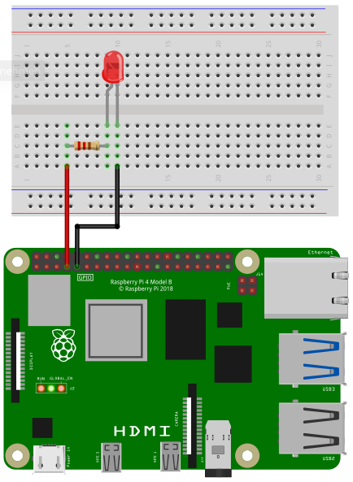

## Wiring

In the following image you can see how to wire a LED.



Depending on the type of LED you need a certain resistor. When using the LED without a resistor,
you will destroy the LED and maybe even parts of your Raspberry Pi.

When you buy a LED, look for two important values in the specification: Forward Voltage and Forward Current.
The third important value is the Supply Voltage. In case of a Raspberry Pi it is 3.3V. Online you
can find many LED resistor calculators. But if you want to see your LED blinking without studying to much
and you don't expect maximum brightness, then go for 220 Ohms or even 1000 Ohms.

Connect the resistor to pin 4 and the LED to ground.

## Code

### Simple blinking

```SmallBASIC
import gpio

gpio.Open()
gpio.SetOutput(4)

for ii = 1 to 10
  v = !v
  gpio.Write(4, v)
  delay(100)
next
```

