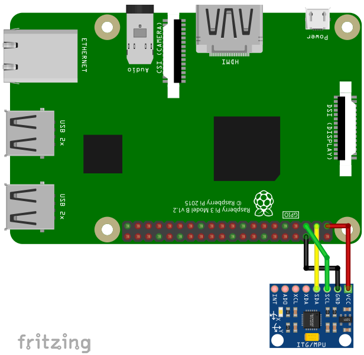

The MPU6050 is a acceleration sensor and gyroscope using
the I2C-protocol for communication.

## Library

To use the MPU6050, import the library `mpu6050`

```SmallBASIC
import mpu6050
```

## Function Reference

### Open Device

```
Open()
Open(interface)
Open(interface, address)
```

Open the MPU6050 on interface `interface` with I2C address `address`.

- `interface`
  - String
  - Path to I2C-Interface.
  - Optional parameter. Default value is `"/dev/i2c-1"`
- `address`
  - Integer: 0 ... 255
  - Device address
  - Optional parameter. Default value is `0x68`.

Example:

```SmallBASIC
Open("/dev/i2c-1", 0x68)
```

### Measure Acceleration

```
a = Acceleration()
```

Measure acceleration in x, y and z direction.

- `a`
  - 1D-array of 3 float
  - `a[0]`: acceleration in x
  - `a[1]`: acceleration in y
  - `a[2]`: acceleration in z
  - in m/s^2


### Read Gyroscope

```
g = Gyroscope()
```

Read gyroscope data in x, y and z direction.

- `g`
  - 1D-array of 3 float
  - `g[0]`: in x
  - `g[1]`: in y
  - `g[2]`: in z
  - in °/s


### Measure Temperature

```
t = Temperature()
```

Measure temperature in °C.

- `t`
  - Float
  - Temperature in °C


### Configure Gyrscope

```
GyroscopeConfig(range)
```

Sets the full scale range of the gyroscope. `range` can have the
values 250, 500, 1000, or 2000 in °/s.

- `range`
  - Integer: 250, 500, 1000, or 2000
  - Full scale range in °/s

### Configure Acceleromter

```
AccelerationConfig(range)
```

Sets the full scale range of the acceleromter. `range` can have the
values 2, 4, 8, or 16 in g (9.81 m/s^2).

- `range`
  - Integer: 2, 4, 8, or 16
  - Full scale range in g (9.81 m/s^2)


### Close device

```
Close()
```

Close the MPU6050 device.


## Example

For running this example, you need a MPU6050. SmallBASIC
PiGPIO 2 is using the I2C-protocol for communication. The
Raspberry Pi supports this protocol in hardware, but by
default the protocol is disabled. Therefore you have to
setup I2C as described [here](./setupi2c.html).

In the next step please wire the sensor as shown in the
following image.



The I2C bus is using pin 2 (SDA) and 3 (SCL). The sensor can be
driven with a voltage of 3.3V. 

```SmallBasic
import mpu6050

mpu6050.open("/dev/i2c-1", 0x68)

delay(500)

for ii = 1 to 1000
    A = mpu6050.Acceleration()
    G = mpu6050.Gyroscope()
    T = mpu6050.Temperature()

    locate 5,0
    print "Acc: [";
    print USING "##.00 "; A[0], A[1], A[2];
    print "]  Gryo: [";
    print USING "####.00 "; G[0], G[1], G[2];
    print "] Temp : ";
    print USING "##.00 "; T

    delay(100)
next

```
