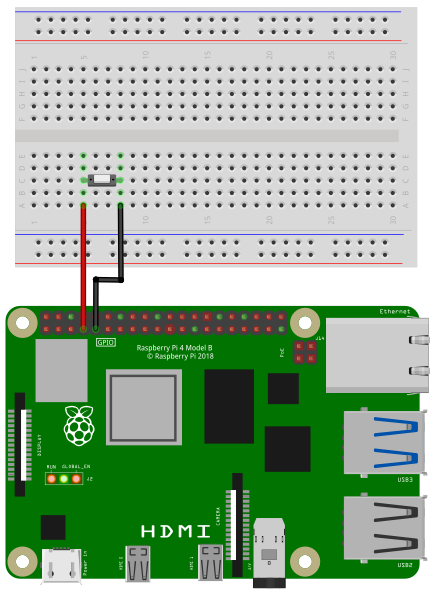

## Wiring

In the following image you see the wiring of a push button. 
When you press the button, the circuit will be closed, otherwise
the circuit is open. The button is connected to pin 4 and
ground. An internal pullup resistor will be enabled automatically.



## Code


### Example 1

```SmallBASIC
import gpio

v = 0

gpio.Open()
gpio.SetInput(4)

while(1)
  print gpio.Read(4)
  delay(500)
wend
```

### Example 2

Connect two push buttons to the Raspberry Pi to the pins 20 and 26.
The example demonstrates the creation of a button object and testing if
the button was pressed. One button will use the `ButtonPressed()` function,
which will return `1` if the button is pressed. The other button will use
the `ButtonPressedAgain()` function. It will return `1`, if the button state
changed from not-pressed to pressed. If you keep the button pressed
without releasing it, this function will return `0`.

```smallbasic
import gpio

Button_1 = CreatePushButton(20)
Button_2 = CreatePushButton(26)

print("Press the buttons and see what happends")

while(1)
	if(ButtonPressed(Button_1)) then
	    print("Button 1")
	endif
	if(ButtonPressedAgain(Button_2)) then
	    print("Button 2")
	endif

    delay(0.1)
wend

'######################################################################

func CreatePushButton(Pin)
    local B
    B.Pin = Pin
    B.DebounceTimer = ticks()
    B.LastState = false

    gpio.SetInput(Pin)

    CreatePushButton = B
end func


func ButtonPressed(byref B)

    if(ticks() - B.DebounceTimer > 10) then
        state = 1 - gpio.Read(B.Pin)
        B.DebounceTimer = ticks()
        if(B.LastState != state) then
            B.DebounceTimer = 0
            B.LastState = state
        end if
    else
        state = B.LastState
    end if

    ButtonPressed = state

end func

func ButtonPressedAgain(byref B)
    local ReturnVal

    ReturnVal = 0

    if(ticks() - B.DebounceTimer > 10) then
        state = 1 - gpio.Read(B.Pin)
        B.DebounceTimer = ticks()
        if(B.LastState != state) then
            B.DebounceTimer = 0
            B.LastState = state
            ReturnVal = state
        end if
    end if

    ButtonPressedAgain = ReturnVal

end func
```


