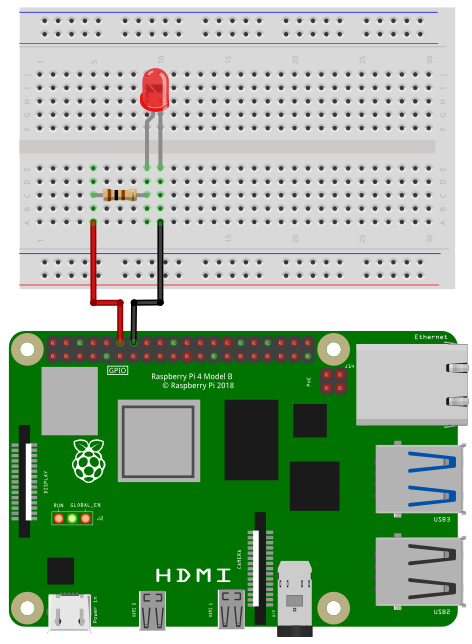
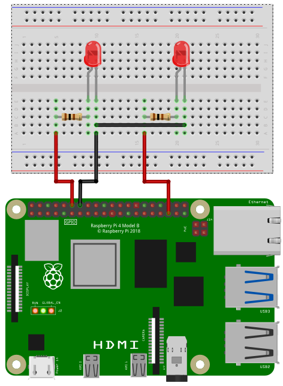

Before using PWM, the correct overlays have to be activated. Please check the [PWM setup instructions](setup_pwm.html).

## PWM Pins

The Raspberry Pi supports up to two hardware controlled PWM channels.


Depending on the configuration of your Raspberry PI the PWM pins are:

| Pin Number | PWM Channel    |
|:----------:|:--------------:|
| 12         | PWM0 (default) |
| 32         | PWM0           |
| 35         | PWM1 (default) |
| 33         | PWM1           |

In default configuration the PWM pins are 12 and 35.


## Library

To access the PWM pins import the library `pwm`:

```SmallBASIC
import pwm
```

## Function Reference

### Open

```
Open()
Open(chipname)
```

Open PWM access to the PWM chip specified by the optional parameter `chipname`.
If `chipname` is not provided, the standard PWM chip of the Raspberry Pi will be
opened.

- `chipname`
  - String
  - PWM chip name
  - Optional parameter. Default value is `pwmchip0`

### Period

```
Period(P)
Period(P, Ch)
```

Set the period `P` of the PWM signal. `P` is in nanoseconds. To set the frequency of
the signal to 1kHz, the corresponding period is `P = 1000000`. `Ch` is the number of the
PWM channel: `0` for PWM0 and `1` for PWM1. `Ch` is an optional parameter. The default value
is `0`.

- `P`
  - Integer >= 0
  - Period of the PWM signal in nanoseconds
- `Ch`
  - Integer: 0 or 1
  - PWM channel: `0` for PWM0 and `1` for PWM1

### DutyCycle

```
DutyCycle(D)
DutyCycle(D, Ch)
```

Set the duty cycle `D` of the PWM signal. `D` is the active time in nanoseconds. Minimum
value of `D` is `0` and maximum value is the period of the PWM signal. `Ch` is the number of the
PWM channel: `0` for PWM0 and `1` for PWM1. `Ch` is an optional parameter. The default value
is `0`.

- `D`
  - Integer 0 ... Period
  - Active time of the PWM signal in nanoseconds
- `Ch`
  - Integer: 0 or 1
  - PWM channel: `0` for PWM0 and `1` for PWM1

### Enable

```
Enable()
Enable(E)
Enable(E, Ch)
```

Enable or disable a PWM channel. Only an enabled channel will output a signal. If `E` is `1`,
the PWM channel will be enabled. If `E` is `0` the PWM channel will be disabled. `Ch` is the number
of the PWM channel: `0` for PWM0 and `1` for PWM1. `E` is an optional parameter. The default
value is `1`. `Ch` is an optional parameter. The default value is `0`.

- `E`
  - Integer: 0 or 1
  - Enable or disable
- `Ch`
  - Integer: 0 or 1
  - PWM channel: `0` for PWM0 and `1` for PWM1

## Example Code

### Single channel PWM

In the following image you can see how to wire a LED to use with PWM.



Depending on the type of LED you need a certain resistor. When using the LED without a resistor,
you will destroy the LED and maybe even parts of your Raspberry Pi.

When you buy a LED, look for two important values in the specification: Forward Voltage and Forward Current.
The third important value is the Supply Voltage. In case of a Raspberry Pi it is 3.3V. Online you
can find many LED resistor calculators. But if you want to see your LED blinking without studying to much
and you don't expect maximum brightness, then go for 220 Ohms or even 1000 Ohms.

Connect the resistor to pin 12 and the LED to ground.

```SmallBASIC
import pwm

' Initialize 
pwm.open("pwmchip0")
pwm.Period(1000000)         ' in ns -> 1kHz
pwm.DutyCycle(0)            ' Active time in ns  -> 0 = off
pwm.Enable()                ' enable pwm0

' Fade from dark to bright
for ii = 1 to 1000000 Step 10000
  pwm.DutyCycle(ii)
  delay(10)
next
```

### Dual channel PWM

In the following image you can see how to wire two LEDs to use with PWM.



Connect the first 1kOhm resistor to pin 12 and the first LED to ground. The second resistor is connected to
pin 35 and the second LED to ground.

```SmallBASIC
import pwm

' Initialize 
pwm.open("pwmchip0")
pwm.Period(1000000, 0)      ' pwm0: in ns -> 1kHz
pwm.Period(1000000, 1)      ' pwm1: in ns -> 1kHz
pwm.DutyCycle(0,0)          ' pwm0: Active time in ns  -> 0 = off
pwm.DutyCycle(0,1)          ' pwm1: Active time in ns  -> 0 = off
pwm.Enable(1,0)             ' enable pwm0
pwm.Enable(1,1)             ' enable pwm1

' Fade from dark to bright at pwm0
' and from bright to dark at pwm1

for ii = 0 to 1000000 Step 10000
  pwm.DutyCycle(ii,0)             ' pwm0  
  pwm.DutyCycle(1000000 - ii,1)   ' pwm1
  delay(10)
next
```