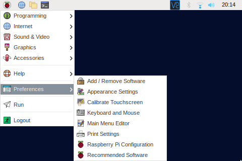
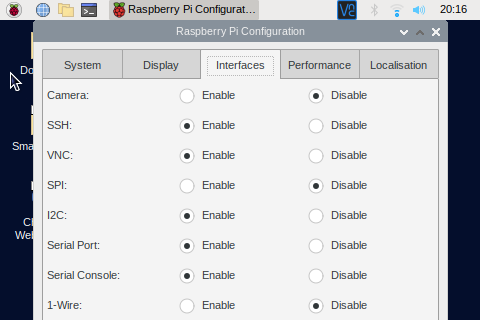

### Desktop

- Open the menu.
- Select "Preferences"
- Start "Raspberry Pi Configuration"
- Open the tab "Interfaces"
- Enable "I2C"
- Save settings
- Restart Raspberry Pi

### Command Line (Terminal)

- Type "sudo raspi-config"
- Select "Interface Options"
- Select "I4 I2C"
- Select "Yes"
