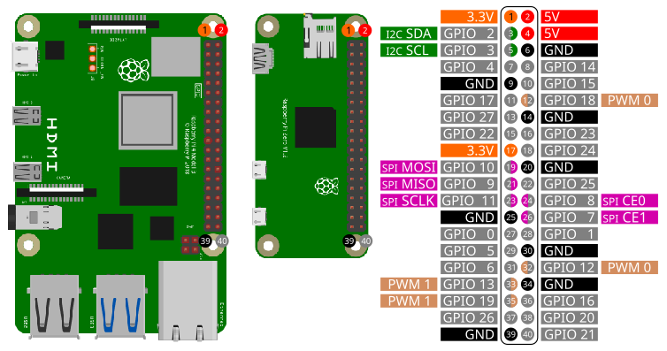

Before start coding you need to setup SPI on the Raspberry Pi. Please follow these [instructions](setupspi.html).

## SPI Pins



| Pin | Function |
|:---:|:--------:|
| 19  | MOSI     |
| 21  | MISO     |
| 23  | SCLK     |
| 22  | CE0      |
| 24  | CE1      |

## Library

Access the basic SPI commands with the library `spi`:

```SmallBASIC
import spi
```

## Function Reference

### Open device

```
Open()
Open(interface)
Open(interface, pagesize)
```

Open the SPI interface `interface` with a page size of `pagesize` in bytes.
`interface` and `pagesize` are optional parameters. Only `pagesize` bytes
can be read/written at once. Larger amount of data will be transferred in chunks.
Change page size only if you know, what you are doing.

- `interface`
  - String
  - SPI interface name
  - Optional parameter. Default value is `/dev/dev/spidev0.0`
- `pagesize`
  - Integer
  - Page size in bytes
  - Optional parameter. Default value is `4096`.

When opening a SPI interface, the following default settings will be applied:

  - MaxSpeed = 1MHz
  - LSBFirst = 0  -> MSB first
  - BitsPerWord = 8
  - Mode = SPI_MODE_0
  
Example:

```smallbasic
Open()
Open("/dev/spidev0.0")
Open("/dev/spidev0.0", 4096)
```

### Get SPI Mode

```smallbasic
Mode = GetMode()
```

Returns the current SPI mode.

| Mode       | Value |
|:-----------|:------|
| SPI_MODE_0 | 0     |
| SPI_MODE_1 | 1     |
| SPI_MODE_2 | 2     |
| SPI_MODE_3 | 3     |

### Set SPI Mode

```smallbasic
SetMode(mode)
```

Set current SPI mode to `mode`.

- `mode`
  - Integer
  - | Mode       | Value |
    |:-----------|:------|
    | SPI_MODE_0 | 0     |
    | SPI_MODE_1 | 1     |
    | SPI_MODE_2 | 2     |
    | SPI_MODE_3 | 3     |

### Get SPI Speed

```smallbasic
speed = GetSpeed()
```

Get current SPI speed `speed` in Hz.

### Set SPI Speed

```smallbasic
SetSpeed(speed)
```

Set SPI speed to `speed` in Hz.

- `speed`
  - Integer
  - Speed in Hz

### Get Bits per Word

```smallbasic
BitsPerWord = GetBitsPerWord()
```

Get the current setting for bits per word.

### Set Bits per Word

```smallbasic
SetBitsPerWord(BitsPerWord)
```

Set bits per word.

- `BitsPerWord`
  - Integer

### Get LSBFirst

```smallbasic
LSBFirst = GetLSBFirst()
```

Get the current setting for LSBFirst. Returns `true` for LSBFirst or `false` for MSBFirst.


### Set LSBFirst

```smallbasic
SetLSBFirst()
SetLSBFirst(LSBFirst)
```

Set LSBFirst or MSBFirst.

- `LSBFirst`
  - Integer: 0 or 1
  - `true` for LSBFirst; `false` for MSBFirst
  - Optional parameter. Default value is `true`.

### Set Delay

```smallbasic
SetDelay(delay)
```

Set transfer delay in microseconds.

- `delay`
  - Integer
  - Delay in microseconds

### Close device

```
Close()
```

When closing a SmallBASIC program, SPI connection will be automatically closed. If you want
to manually close SPI access , use this function.


### Write to SPI interface

```
Write(dataByte)
Write(dataArray)
```

Send one byte `dataByte` or an 1d array `dataArray` of bytes to the interface.

- `dataByte`
  - Integer: 0 ... 255
  - One byte of data
- `dataArray`
  - 1D-array of integers [0 ... 255, 0 ... 255, ... ]
  - Array of byte data

Example:

```SmallBasic
Write(0x20)
Write([0x20, 0x21, 0xA3])
```

### Write to register of a SPI device 

```
WriteReg(reg, dataByte)
WriteReg(reg, dataArray)
```

Send one byte `dataByte` or an 1d array `dataBytes` of bytes to a register `reg` of
the devices.

- `reg`
  - Integer: 0 ... 255
  - Device register
- `dataByte`
  - Integer: 0 ... 255
  - One byte of data
- `dataArray`
  - 1D-array of integers [0 ... 255, 0 ... 255, ... ]
  - Array of byte data

Example:

```smallbasic
WriteReg(id, 0x05, 0x20)
WriteReg(id, 0x05, [0x20, 0x21, 0xA3])
```

### Read from a SPI device

```
res = Read()
res = Read(bytes)
```

Read number of bytes `bytes` from the device with device id `id`. `bytes` is an
optional parameter.

- `bytes`
  - Integer
  - Number of bytes to read from device
  - Optional parameter. Default value is `1`
- `res`
  - Integer or 1d-array of integers
  - Data read from device
  - If more than 1 byte is read, `res` is an 1d array.

### Read from a register of a SPI device

```
res = Read(reg)
res = Read(reg, bytes)
```
Read number of bytes `bytes` from the register `reg` of the device. 
`bytes` is an optional parameter.

- `reg`
  - Integer: 0 ... 255
  - Device register
- `bytes`
  - Integer
  - Number of bytes to read from device.
  - Optional parameter. Default value is `1`
- `res`
  - Integer or 1d-array of integers
  - Data read from device
  - If more than 1 byte is read, `res` is an 1d array.

Example:

```smallbasic
res = ReadReg(0x05)       ' Read one byte from register 0x05
res = ReadReg(0x05, 5)    ' Read five bytes from register 0x05
```

### Sequential Read and Write

```
res = ReadWrite(writeArray)
res = ReadWrite(writeArray, bytes)
```

First transfer the 1d-array `writeArray` to the device and after finishing
the write-action number of bytes `bytes` will be read. `bytes` is an optional
parameter.

- `dataArray`
  - 1D-array of integers [0 ... 255, 0 ... 255, ... ]
  - Array of byte data
  - Array with 1 element is allowed
- `res`
  - 1d array of integers: [0 ... 255, 0 ... 255, ...]
  - Data read from device

Example:

```smallbasic
res = ReadWrite([0x20, 0x21, 0xA3])
res = ReadWrite([0x20, 0x21, 0xA3], 1)
```

### Parallel Read and Write

```
res = ReadWriteParallel(writeArray)
res = ReadWriteParallel(writeArray, bytes)
```

Transfer the 1d-array `writeArray` to the device and at the same time
read number of bytes `bytes`. `bytes` is an optional
parameter.

- `dataArray`
  - 1D-array of integers [0 ... 255, 0 ... 255, ... ]
  - Array of byte data
  - Array with 1 element is allowed
- `res`
  - 1d array of integers: [0 ... 255, 0 ... 255, ...]
  - Data read from device

Example:

```smallbasic
res = ReadWriteParallel([0x20, 0x21, 0xA3])
res = ReadWriteParallel([0x20, 0x21, 0xA3], 1)
```


## Example Code

### 1. BMP280 - Temperature and Pressure Sensor


Please be careful, the sensors are usually driven with 3.3V but depending
on the breakout board supply voltages of 5V are possible. 

```SmallBASIC
import spi

spi.Open("/dev/spidev0.0")

' Read chip id. BMP280 has id 0x58
id = spi.ReadReg(0xD0, 1)
print "Chip ID:", "0x"; hex(id)  

delay(500)

' Get calibration data
cal = spi.ReadReg(0x88, 24)
dig_T1 = ByteTo16Bit(cal[0], cal[1])
dig_T2 = Short(ByteTo16Bit(cal[2], cal[3]))
dig_T3 = Short(ByteTo16Bit(cal[4], cal[5]))
dig_P1 = ByteTo16Bit(cal[6], cal[7])
dig_P2 = Short(ByteTo16Bit(cal[8], cal[9]))
dig_P3 = Short(ByteTo16Bit(cal[10], cal[11]))
dig_P4 = Short(ByteTo16Bit(cal[12], cal[13]))
dig_P5 = Short(ByteTo16Bit(cal[14], cal[15]))
dig_P6 = Short(ByteTo16Bit(cal[16], cal[17]))
dig_P7 = Short(ByteTo16Bit(cal[18], cal[19]))
dig_P8 = Short(ByteTo16Bit(cal[20], cal[21]))
dig_P9 = Short(ByteTo16Bit(cal[22], cal[23]))

' Configure sensor
spi.WriteReg(0x74, 0b01101111)     ' 011: 4x oversampling temperature; 011: 4x oversampling pressure; 11: normal power mode
spi.WriteReg(0x75, 0b01010000)     ' 010: t_standby = 125ms;  100: 5 Samples to reach 75%; 00: 4-wire SPI

for ii = 1 to 5
  M = Measure()
  print "T = "; M[0]; " °C   P = "; round(M[1]/100,2);" hPa"
  delay(200)
next


'#############################################################################

func ByteTo16bit(LSB, MSB)
  return (MSB lshift 8) | LSB
end

func Short(a)
  if(a > 32767) then
    return a - 65536
  else
    return a
  endif
end

func Measure()
  local var1, var2, T, M, T_uncompensated, t_fine, P_uncompensated, P

  ' Get temperature
  M = spi.ReadReg(0xFA, 3)  
  T_uncompensated = (M[0] lshift 12) | (M[1] lshift 4) | (M[2] rshift 4)  
  

  var1 = (((T_uncompensated rshift 3) - (dig_T1 lshift 1))*dig_T2) rshift 11
  var2 = (((((T_uncompensated rshift 4) - dig_T1) * ((T_uncompensated rshift 4) - dig_T1)) rshift 12) * dig_T3) rshift 14
  t_fine = var1 + var2
  T = (t_fine * 5 + 128) rshift 8
  T = T / 100

  ' Get pressure
  M = spi.ReadWrite([0xF7], 3)
  
  P_uncompensated = (M[0] lshift 12) | (M[1] lshift 4) | (M[2] rshift 4) 

  var1 = t_fine - 128000
  var2 = var1 * var1 * dig_P6
  var2 = var2 + ((var1 * dig_P5) lshift 17)
  var2 = var2 + (dig_P4 lshift 35)
  var1 = ((var1 * var1 * dig_P3) rshift 8) + ((var1 * dig_P2) lshift 12)
  var1 = (((1 lshift 47) + var1)) * dig_P1 rshift 33
  if (var1 == 0) then return 0
  P = 1048576 -  P_uncompensated
  P = (((P lshift 31) - var2) * 3125) / var1
  var1 = (dig_P9 * (P rshift 13) * (P rshift 13)) rshift 25
  var2 = (dig_P8 * P) rshift 19
  P = ((P + var1 + var2) rshift 8) + (dig_P7 lshift 4)
  P = P/256
  return [T, P]
end
```

### 2. ST7789 - TFT RGB Display


```SmallBASIC
import spi
import gpio
import canvas

const DC   = 17      ' Data or command -> HIGH = data / LOW = command 
const RST  = 27      ' Chip reset
const BL   = 22      ' Blacklight control

const ST7789_NOP            = 0x00
const ST7789_SWRESET        = 0x01
const ST7789_SLPOUT         = 0x11
const ST7789_NORON          = 0x13
const ST7789_INVON          = 0x21
const ST7789_DISPON         = 0x29
const ST7789_CASET          = 0x2A
const ST7789_RASET          = 0x2B
const ST7789_RAMWR          = 0x2C
const ST7789_COLMOD         = 0x3A
const ST7789_MADCTL         = 0x36
const ST7789_MADCTL_MY      = 0x80
const ST7789_MADCTL_MX      = 0x40
const ST7789_MADCTL_MV      = 0x20
const ST7789_MADCTL_ML      = 0x10
const ST7789_MADCTL_RGB     = 0x00
const ST7789_240x240_XSTART = 0
const ST7789_240x240_YSTART = 0
const ST7789_TFTWIDTH       = 240
const ST7789_TFTHEIGHT      = 240

const BLACK   = 0x0000
const BLUE    = 0x001F
const RED     = 0xF800
const GREEN   = 0x07E0
const CYAN    = 0x07FF
const MAGENTA = 0xF81F
const YELLOW  = 0xFFE0
const WHITE   = 0xFFFF

const HIGH      = TRUE
const LOW       = FALSE
const PIN_DELAY = 0

colstart = 0
rowstart = 0
ystart   = 0
xstart   = 0
const WIDTH    = 240
const HEIGHT   = 240

Setup(240, 240)             ' parameter: TFT width , TFT height

' Init canvas
c = canvas.create(WIDTH, HEIGHT, BLACK)
c._fontSize = 29

' Draw some graphics
c._pen = BLACK                                 
canvas.draw_rect_filled(c, 0, 0, WIDTH, HEIGHT) ' Clear screen
c._pen = RED                                  
canvas.draw_circle(c, 25, 210, 16, true)
c._pen = RGBto565(140, 130,255)
canvas.draw_string(c, "SPI with", 90, 15)
canvas.draw_string(c, "SMALLBASIC", 90, 50)
c._pen = WHITE
canvas.draw_line(c, 0, 0, 239, 239)
canvas.draw_rect(c, 0, 0, 239, 239)


t1 = ticks()
TransferFramebuffer(c._dat)         ' c._dat is the canvas framebuffer
print ticks() - t1

spi.close()
print "done"

'########################################

sub Setup(w, h)
    Print "Connect to TFT"
    spi.open("/dev/spidev0.0")
    print "Max. speed: ", spi.GetMaxSpeed()
    Print "Set speed to 10 MHz"
    spi.SetMaxSpeed(10000000)
    Print "Set mode to SPI 0"
    spi.SetMode(0)
    Print "Open GPIO"
    gpio.Open()
    Print "Configure gpio"    
    gpio.SetOutput(RST)
    gpio.SetOutput(DC)
    gpio.SetOutput(BL)
    Print "Connection established"

    if(w == 240 and h == 240) then rowstart = 80
    width = w
    height = h

    ' Background light on
    gpio.write(BL, HIGH)

    ' Hardware reset
    gpio.write(RST, HIGH)
    delay(50)
    gpio.write(RST, LOW)
    delay(50)
    gpio.write(RST, HIGH)
    delay(150)

    'Init
    writeCmd(ST7789_SWRESET) : delay(150)
    writeCmd(ST7789_SLPOUT)  : delay(500)
    writeCmd(ST7789_COLMOD)  : writeData8(0x55) : delay(10)     ' RGB565
    writeCmd(ST7789_MADCTL)  : writeData8(0x0)
    writeCmd(ST7789_CASET)   : writeData16(ST7789_240x240_XSTART) : writeData16(ST7789_TFTWIDTH + ST7789_240x240_XSTART)
    writeCmd(ST7789_RASET)   : writeData16(ST7789_240x240_YSTART) : writeData16(ST7789_TFTHEIGHT + ST7789_240x240_YSTART)
    writeCmd(ST7789_INVON)   : delay(10)
    writeCmd(ST7789_NORON)   : delay(10)
    writeCmd(ST7789_DISPON)  : delay(10)

    'SetRotation(2)
end

func RGBto565(r,g,b)
    return ((((r) BAND 0xF8) lshift 8) BOR (((g) BAND 0xFC) lshift 3) BOR ((b) rshift 3)) 
end

sub WriteCmd(c) 
  gpio.write(DC, LOW)
  spi.write(c)
end

sub WriteData8(Data_Uint8)
  gpio.write(DC, HIGH)
  spi.write(Data_Uint8)
end

sub WriteData16(Data_Uint16)
  gpio.write(DC, HIGH)
  spi.write([Data_Uint16 rshift 8, Data_Uint16 BAND 0xFF])
end

sub SetRotation(m) 
  writeCmd(ST7789_MADCTL)
  rotation = m BAND 3
  select case rotation
    case 0
      writeData8(ST7789_MADCTL_MX BOR ST7789_MADCTL_MY BOR ST7789_MADCTL_RGB)
      xstart = colstart
      ystart = rowstart
    case 1
      writeData8(ST7789_MADCTL_MY BOR ST7789_MADCTL_MV BOR ST7789_MADCTL_RGB)
      ystart = colstart
      xstart = rowstart
    case 2
      writeData8(ST7789_MADCTL_RGB)
      xstart = 0
      ystart = 0
    case 3
      writeData8(ST7789_MADCTL_MX BOR ST7789_MADCTL_MV BOR ST7789_MADCTL_RGB)
      xstart = 0
      ystart = 0
  end select
end


'sub setAddrWindow(xs, xe, ys, ye)
sub setAddrWindow(xs, ys, xe, ye)
  xs += xstart
  xe += xstart
  ys += ystart
  ye += ystart

  'CASET
  WriteCmd(ST7789_CASET)  
  gpio.write(DC, HIGH)                                  ' data (active high)
  spi.write([xs rshift 8, xs BAND 0xFF])
  spi.write([xe rshift 8, xe BAND 0xFF])
  ' RASET
  WriteCmd(ST7789_RASET)
  gpio.write(DC, HIGH)                                  ' data (active high)
  spi.write([ys rshift 8, ys BAND 0xFF])
  spi.write([ye rshift 8, ye BAND 0xFF])
end


sub TransferFramebuffer(byref fb)
  local ii, xx, yy, FrameBuffer_8bit, w, h

  dim FrameBuffer_8bit(2 * WIDTH * HEIGHT)

  ii = 0
  h = HEIGHT - 1
  w = WIDTH - 1
  for xx = 0 to w
    for yy = 0 to h
      FrameBuffer_8bit[ii]     = fb[xx, yy] rshift 8
      FrameBuffer_8bit[ii + 1] = fb[xx, yy] BAND 0xFF
      ii += 2
    next
  next 

  setAddrWindow(0, 0, w, h) 
  WriteCmd(ST7789_RAMWR)
  gpio.Write(DC, HIGH)
  spi.Write(FrameBuffer_8bit)
end
```
