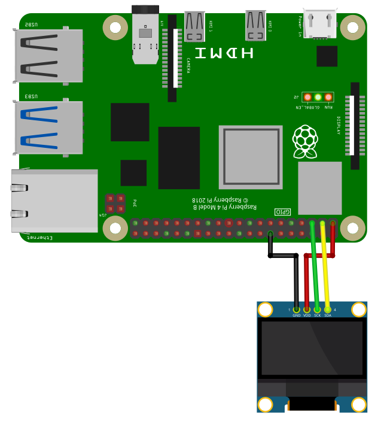

The SSD1306 OLEDs are monochrom graphics displays using the
I2C-interface. Displays with 128x64 and 128x32 pixels are
supported. Additionally two-color display exists, but I
haven't tested these.

## Library

To use the SSD1306, import the library `ssd1306`

```SmallBASIC
import ssd1306
```

## Function Reference

### Open Device

```
Open()
Open(interface)
Open(interface, address)
Open(interface, address, nx)
Open(interface, address, nx, ny)
```

Open the SSD1306 on interface `interface` with I2C address
`address` and number of pixels `nx`, `ny`. Only OLEDs with
128x64 or 128x32 pixels are supported.

- `interface`
  - String
  - Path to I2C-Interface.
  - Optional: default value is `"/dev/i2c-1"`
- `address`
  - Integer: 0 ... 255
  - Device address
  - Optional: default value is `0x3C`
- `nx`
  - Integer: 0 ... 32768
  - Number of pixel in x direction
  - Optional: default value is `128`
- `ny`
  - Integer: 0 ... 32768
  - Number of pixel in y direction
  - Optional: default value is `64`

Example:

```SmallBASIC
Open("/dev/i2c-1", 0x3C, 128, 32)
```

### Close Device

```
Close()
```

Close the SSD1306 OLED device.

### Display Buffer

```
Display()
```

Display the current buffer. If you perform a drawing command, only the
buffer will be changed. The display will not show the changes until
`Display()` is called.

### Clear Screen

```
Cls()
Cls(color)
```

Clear the screen using color `color`. If color is omitted, the current
background color is used.

- `color`
  - Integer: 32bit
  - Clear color
  - Optional parameter. Default value is current background color.

### Draw a Pixel

```
Pset(x1, y1)
Pset(x1, y1, color)
```

Draw a pixel at point `(x1, y1)` with color `color`

- `x1, y1`
  - Integer: 0 ... 65535
  - Position in pixel
- `color`
  - Integer: 32bit
  - Line color
  - Optional parameter. Default value is current foreground color

### Draw a Line

```
Line(x1, y1, x2, y2)
Line(x1, y1, x2, y2, color)
```

- `id`
  - Deviced id
- `x1, y1`
  - Integer: 0 ... 65535
  - Position of start point in pixel
- `x2, y2`
  - Integer: 0 ... 65535
  - Position of end point in pixel
- `color`
  - Integer: 32bit
  - Line color
  - Optional parameter. Default value is current foreground color.

### Draw a Rectangle

```
Rect(x1, y1, x2, y2)
Rect(x1, y1, x2, y2, color)
Rect(x1, y1, x2, y2, color, fill)
```

Draw a rectangle with the top left corner at point `(x1, y1)` and bottom
right corner at `(x2, y2)` with line color `color`. If `fill` is 1 (true),
a filled rectangle will be drawn.

- `x1, y1`
  - Integer: 0 ... 65535
  - Position of top left corner in pixel
- `x2, y2`
  - Integer: 0 ... 65535
  - Position of bottom right corner in pixel
- `color`
  - Integer: 32bit
  - Line color
  - Optional parameter. Default value is current foreground color.
- `fill`
  - Integer: 0, 1
  - If 1, a filled rectangle will be drawn.
  - Optional parameter. Default value is 0.

### Draw a Rectangle with Round Corners

```
Roundrect(x1, y1, x2, y2)
Roundrect(x1, y1, x2, y2, radius)
Roundrect(x1, y1, x2, y2, radius, color)
Roundrect(x1, y1, x2, y2, radius, color, fill)
```

Draw a rectangle with the top left corner at point `(x1, y1)` and bottom
right corner at `(x2, y2)` with line color `color` and rounded corners. The
radius in pixel of the corners if given by `radius`. If `fill` is 1 (true),
a filled rectangle will be drawn.

- `x1, y1`
  - Integer: 0 ... 65535
  - Position of top left corner in pixel
- `x2, y2`
  - Integer: 0 ... 65535
  - Position of bottom right corner in pixel
- `radius`
  - Integer: 0 ... 255
  - Radius if corners in pixel
  - Optional parameter. Default value is 4.
- `color`
  - Integer: 32bit
  - Line color
  - Optional parameter. Default value is current foreground color
- `fill`
  - Integer: 0, 1
  - If 1, a filled rectangle will be drawn.
  - Optional parameter. Default value is 0.

### Draw a Circle

```
Circle(x, y, radius)
Circle(x, y, radius, color)
Circle(x, y, radius, color, fill)
```

Draw a circle at position `(x, y)` with radius `radius` in pixel. `color`
defines the line color. If `fill` is set to `1` (`true`), then the
circle is filled with `color`. If no color is given, the current foreground
color will be used.

- `x`
  - Integer: 0 ... 65535
  - X-position in pixel
- `y`
  - Integer: 0 ... 65535
  - Y-position in pixel
- `radius`
  - Integer: 0 ... 65535
  - Radius of the circle in pixel
- `color`
  - Integer: 32bit
  - Line or fill color
  - Optional parameter. Default value is current foreground color.
- `fill`
  - Integer: 0, 1
  - If 1, a filled circle will be drawn
  - Optional parameter. Default value 0

### Draw a Triangle

```
Triangle(x1, y1, x2, y2, x3, y3)
Triangle(x1, y1, x2, y2, x3, y3, color)
Triangle(x1, y1, x2, y2, x3, y3, color, fill)
```

Draw a triangle with the corner points `(x1, y1)`, `(x2, y2)` and
`(x3, y3)` with line color `color`. If `fill` is 1 (true), a filled
triangle will be drawn.

- `x1, y1`, `x2, y2`, `x3, y3`
  - Integer: 0 ... 65535
  - Position of corner points in pixel
- `color`
  - Integer: 32bit
  - Line color
  - Optional parameter. Default value is current foreground color
- `fill`
  - Integer: 0, 1
  - If 1, a filled rectangle will be drawn.
  - Optional parameter. Default value is 0.

### Print Text

```
Print(text)
Print(text, color)
```

Print text `text` with text color `color`. After printing the text, the
text cursor advances by one text-line. The following special characters are
supported:

| Character | Description                              |
|:---------:|:-----------------------------------------|
| `\a`      | Set cursor position to upper left (0, 0) |
| `\b`      | Move cursor back by one position         |
| `\n`      | Go to start of current line              |
| `\r`      | Go to line below                         |

- `text`
  - String
  - Text to be printed
- `color`
  - Integer: 32bit
  - Line color
  - Optional parameter. Default value is current foreground color.

### Set Text Cursor Position

```
At()
At( x)
At(x, y)
```

Set the text cursor to the pixel `(x, y)`.

- `x`
  - Integer: 0 ... 65535
  - X-position in pixel
  - Optional parameter. Default value is `0`
- `y`
  - Integer: 0 ... 65535
  - Y-position in pixel
  - Optional parameter. Default value is `0`

### Set Text Size

```
SetTextSize(size)
```

Set text size to `size`. `size` must be an multiple of 8.

- `size`
  - Integer: 8, 16, 24, 32, ..., 8*n
  - Text size in pixel

### Copy Array to Screen

```
SetArray(A)
SetArray(A, x)
SetArray(A, x, y)
SetArray(A, x, y, trans)
```

Copy the content of the 2D-array `A` to screen at position `(x,y)` using
transparency mode `trans`. The following transparency modes are supported:

| Mode | Description                                             |
|:----:|:--------------------------------------------------------|
| 0    | no transparency                                         |
| 1    | Every element of `A` with value `0` will be transparent |

- `A`
  - 2D-Array of integers: Every element is 32bit long.
  - Every element contains the color of a pixel
- `x` and `y`
  - Integer: 0 ... 65535
  - Position of copied area in pixel
  - Optional parameter. Default value is (0, 0).
- `trans`
  - Integer: 0, 1
  - Transparency mode
  - 0 -> no transparency
  - 1 -> transparancy
  - Optional parameter. Default value is 0.

### Copy Screen to Array

```
A = GetArray()
A = GetArray(x)
A = GetArray(x, y)
A = GetArray(x, y, w)
A = GetArray(x, y, w, h)
```

Copy the screen context inside the rectangle with top-left corner at
`(x, y)`, a width of `w` and a height of `h` to the 2D-array `A`.

- `A`
  - 2D-Array of integers: Every element is 32bit long
  - Every element contains the color of a pixel
- `x` and `y`
  - Integer: 0 ... 65535
  - Position of top-left corner of copied area in pixel
  - Optional parameter. Default value is (0, 0).
- `w`
  - Integer: 0 ... 65535
  - Width if copy area in pixel
  - Optional parameter. Default value is screen size in x.
- `h`
  - Integer: 0 ... 65535
  - Height if copy area in pixel
  - Optional parameter. Default value is screen size in y.

### Set Brightness

```
SetBrightness()
SetBrightness(b)
```

Set brightness of the display from 0 to 255. 0 is dark, 255 bright.

- `b`
  - Integer: 0 ... 255
  - Brightness of display.
  - 0: dark
  - 255: bright
  - Optional parameter. Default value is 255.

### Invert Display

```
InvertDisplay()
```

Invert display: Black to white and white to black.

### Turn on Display

```
DisplayOn()
```

Turn display on.

### Turn off Display

```
DisplayOff()
```

Turn display off.


## Example

For running this example, you need a SSD1306 compatible OLED display.
OLEDs with 128x64 or 128x32 pixels are supported. SmallBASIC PiGPIO 2
is using the I2C-protocol for communication. The Raspberry Pi support
this protocol in hardware, but by default the protocol is disabled.
Therefore you have to setup I2C as described [here](./setupi2c.html).

In the next step please wire the display as shown in the following
image.



The I2C bus is using pin 2 (SDA1) and 3 (SCL1). Please be careful,
these OLEDs are usually driven with 3.3V. Don't connect to 5V unless 
you know what you are doing.

### 1. Example

```SmallBasic
import ssd1306

const ADDRESS = 0x3C
const WIDTH   = 128
const HEIGHT  = 64

Print "Connect to SSD1306 OLED display"
ssd1306.Open("/dev/i2c-1", ADDRESS)
Print "Connection established"

delay(2000)
ssd1306.Cls()
ssd1306.Circle(25, 40, 16, 1, true)
ssd1306.At(50,5): ssd1306.Print("I2C with", 1)
ssd1306.At(50,14): ssd1306.Print("SMALLBASIC", 1)
ssd1306.line(0, 0, 127, 63)
ssd1306.rect(0,0,127,63)

' Transfer framebuffer to display
s = ticks
ssd1306.Display()
print ticks - s
delay(2000)

' Set brightness
ssd1306.SetBrightness(20)
delay(1000)
ssd1306.SetBrightness(255)
delay(1000)

' Display on/off
ssd1306.DisplayOff()
delay(1000)
ssd1306.DisplayOn()
delay(1000)

' Set inverse
ssd1306.InvertDisplay()
delay(1000)
ssd1306.InvertDisplay()

print "done"
```

### 2. Example: Copy Array

```smallbasic
import ssd1306

ssd1306.Open("/dev/i2c-1")
delay(1000)

ssd1306.SetBrightness(128)
ssd1306.Cls()

ssd1306.Pset(10,0)
ssd1306.Line(0,0,127,63)
ssd1306.RoundRect(58,26,40,20,5)
ssd1306.Circle(118,10,5,1,1) 'Filled with white
ssd1306.Triangle(118,30, 113,45, 123,45, 1, 1) 'Filled with white
ssd1306.At(0,46)
ssd1306.SetTextSize(16)
ssd1306.Print("SmallBASIC")
ssd1306.Display()

'Let's move a image of a smiley with transparency over the screen

'Create an image array with 16x16 Pixels
dim SmilyGuyArray(15,15)

for yy = 0 to 15
  for xx = 0 to 15
    read d
    SmilyGuyArray(xx,yy) = d
  next
next

dim Background

for xx = 1 to 127
  ' Save the part of the OLED display, where we want to draw the smiley.
  Background = ssd1306.GetArray(xx, 25, 16, 16)
  ' Copy the array to the display: 
  ' Mode = 3 -> Pixel value: 0=Black;
  ' 255=White; Every other number is
  ' rendered transparent
  ssd1306.SetArray(SmilyGuyArray, xx, 25, 3)
  ssd1306.Display()
  ' Copy the saved background back to the display. This will remove the
  ' smiley. In the next iteration of the loop, you have the original
  ' background image.
  ssd1306.SetArray(Background, xx, 25)
next

delay(2000)

ssd1306.Close()

print("Done")


'Smiley Guy
'0=Black; 255=White; Every other number is transparent
DATA   1,  1,  1,255,255,255,255,255,255,255,255,255,255,  1,  1,  1
DATA   1,  1,255,255,255,255,255,255,255,255,255,255,255,255,  1,  1
DATA   1,  1,255,255,255,255,255,255,255,255,255,255,255,255,  1,  1
DATA   1,  1,255,255,  0,  0,  0,  0,  0,  0,  0,  0,255,255,  1,  1
DATA   1,  1,255,  0,255,255,255,  0,  0,255,255,255,  0,255,  1,  1
DATA   1,255,  0,  0,  0,  0,  0,  0,  0,  0,  0,  0,  0  ,0  ,255,1
DATA 255,255,  0,  0,255,255,  0,  0,  0,  0,255,255,  0,  0,255,255
DATA 255,255,  0,  0,255,255,  0,255,  0,  0,255,255,  0,  0,255,255
DATA 255,255,  0,  0,  0,  0,  0,255,255,  0,  0,  0,  0,  0,255,255
DATA   1,255,  0,  0,  0,  0,  0,  0,  0,  0,  0,  0,  0,  0,255,  1
DATA   1,255,  0,  0,255,  0,  0,  0,  0,  0,  0,255,  0,  0,255,  1
DATA   1,  1,255,  0,  0,255,  0,  0,  0,  0,255,  0,  0,255,  1,  1
DATA   1,  1,255,  0,  0,  0,255,255,255,255,  0,  0,  0,255,  1,  1
DATA   1,  1,  1,255,  0,  0,  0,  0,  0,  0,  0,  0,255,  1,  1,  1
DATA   1,  1,  1,  1,255,255,255,255,255,255,255,255,  1,  1,  1,  1
DATA   1,  1,  1,  1,  1,255,255,255,255,255,255,  1,  1,  1,  1,  1

```

### 3. Example: 128x32 pixel

```smallbasic
import ssd1306

ssd1306.Open("/dev/i2c-1", 0x3C, 128, 32)
delay(1000)

ssd1306.SetBrightness(128)
ssd1306.Cls()

ssd1306.Pset(10,0)
ssd1306.Line(0,0,127,31)
ssd1306.RoundRect(58,5,40,20,5)
ssd1306.Circle(118,10,5,1,1) 'Filled with white
ssd1306.At(0,46)
ssd1306.SetTextSize(16)
ssd1306.Print("SmallBASIC")

ssd1306.Display()

delay(2000)

ssd1306.Close()

print("Done")
```